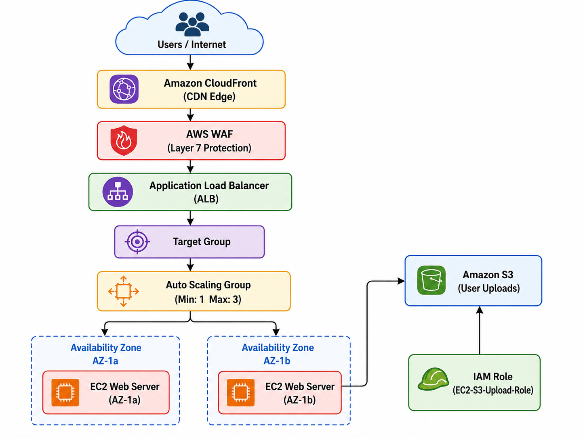

# Secure & Scalable 3-Tier Web Architecture with AWS Security Perimeters

## 📌 Project Overview
This project demonstrates the implementation of a highly secure, automated, and scalable 3-tier web architecture on AWS. It focuses on isolating web workloads inside private subnets, establishing perimeter defenses against web exploits, and integrating credential-less, least-privilege cloud storage access. 

The application architecture follows end-to-end routing:  
**CloudFront (Edge) ➡️ AWS WAF + Application Load Balancer (ALB) ➡️ Auto Scaling Group (ASG) / EC2 ➡️ RDS Database**

---

## 🏗️ Architecture Design & Components

<p align="center">
  
</p>

### 1. Compute Layer & Auto Scaling
* **Launch Template:** Standardized server deployment using an Ubuntu AMI on `t3.micro` instances.
* **Auto Scaling Group (ASG):** Dynamically scales instances horizontally based on cluster load metrics (Desired: 2, Minimum: 1, Maximum: 4).
* **Network Isolation:** All backend EC2 web servers are strictly quarantined inside **Private Subnets** with no public IP allocation, rendering them invisible to direct internet vectors.

### 2. Network & Application Security (Layer 7 Defense)
* **Application Load Balancer (ALB):** Anchored in public subnets to act as the reverse-proxy gateway for inbound HTTP/HTTPS traffic.
* **AWS WAF (Web Application Firewall):** Deployed a Regional Web ACL directly onto the ALB leveraging the **AWS Common Rule Set (`AWSManagedRulesCommonRuleSet`)**. This establishes instant Layer 7 pattern protection against top web application vulnerabilities, including SQL Injections (SQLi), Cross-Site Scripting (XSS), and malicious inputs.

### 3. Least-Privilege Identity Management (IAM)
* **Zero Hardcoded Keys Rule:** To completely eliminate credential exposure or management overhead within app environments, no static `AWS_ACCESS_KEY_ID` or `AWS_SECRET_ACCESS_KEY` fields are stored inside configuration profiles.
* **IAM Instance Profiles:** Created a tailored IAM Role with exact scoped permissions (`s3:PutObject` and `s3:GetObject`) pinned tightly to the application bucket ARN. This role is attached directly to the EC2 Launch Template, allowing application threads calling Python `boto3` libraries to dynamically assume secure, short-lived security tokens via the Instance Metadata Service (IMDS).

### 4. Cost-Optimized Automated Storage (Amazon S3)
* Deployed a dedicated storage bucket configured to ingest media and file processing streams via an abstracted backend upload worker layer.
* **Lifecycle Policy Engine:** Implemented automated rules scoped precisely to the `/uploads/` prefix path to manage object transitions and optimize running expenditures:
  * **Day 0 - 30:** S3 Standard (Frequent millisecond execution).
  * **Day 30:** Transitions automatically to **S3 Standard-Infrequent Access (Standard-IA)** for lower baseline storage rates.
  * **Day 90:** Transitions automatically to **Amazon S3 Glacier Flexible Retrieval** for long-term data cold-vault archival.
  * **Day 365:** Permanent object expiration to strictly truncate rolling storage bloat.

---

## 🚀 Step-by-Step Implementation Flow

### Phase 1: Storage & Identity Provisioning
1. Provisions the centralized Amazon S3 bucket.
2. In the IAM console, creates a specific inline access policy and binds it to an Amazon EC2 service-assumable trusted entity role.

### Phase 2: Launch Configuration & Server Auto Scaling
1. Generates an EC2 Launch Template containing selected AMI kernels, key pairs, and assigns the custom IAM Instance Profile under advanced options.
2. Constructs an empty ALB Target Group using dynamic instance target registration.
3. Launches the Auto Scaling Group mapped explicitly across multiple cross-AZ Private Subnets and hooks target endpoints to the active ALB group context.

### Phase 3: Edge Firewall Layer Activation
1. Spins up an AWS WAF Web ACL inside the Regional resources domain.
2. Attaches the perimeter rules directly onto the Application Load Balancer ARN.
3. Injects the AWS Managed Rule Core Group to continuously evaluate inbound traffic headers for malicious patterns.

---

## 🛠️ Verification & Testing Protocols

### 1. Verifying IAM Instance Profile Access
To ensure that backend servers can securely sign API requests using assumed metadata roles, verify the IMDS loop directly from the machine console:
```bash
curl [http://169.254.169.254/latest/meta-data/iam/info](http://169.254.169.254/latest/meta-data/iam/info)
